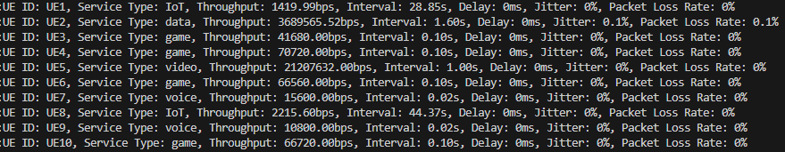

# Wellcom to RAN Fusion

## Overview

Welcome to the RANFusion (RAN) Simulator! This simple tool is designed to simulate the behavior and performance of 5G networks like Handover between the sectors. Our simulator offers a detailed framework to test and analyze various components of 5G technology.
This is the sample result for running 10 UE and see the logs:

## Features

- **Realistic RAN Simulation:** Experience accurate modeling of 5G network elements and protocols.
- **Support Multiple gNodeB, Cell, Sector, UE**
- **Customizable Scenarios:** Easily configure different network scenarios, including urban, suburban, and rural environments.
- **Performance Metrics via InfluxDB:** Gain insights with a range of metrics like throughput, latency, and packet loss.

## Getting Started

### Prerequisites

Before you start, make sure you have the following installed:
- Windows, Linux, or macOS
- Python 3.x
- Git

### Installation

Follow these steps to set up the RANFusion Simulator:

1. **Clone the Repository**
2. **Navigate to the Directory**
3. **Install Dependencies**
   pip install -r requirements.txt
5. **RUN the setup.py and wait**
6. **Install InfluxDB**
7. **Get the API token of the Influxdb via GUI (http://localhost:8086/)**
8. **past Token into setup.py**
9. **run main.py**
   
   

   
